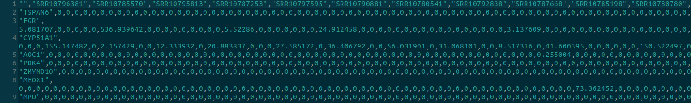
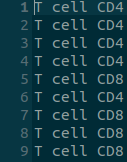
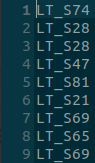
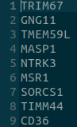
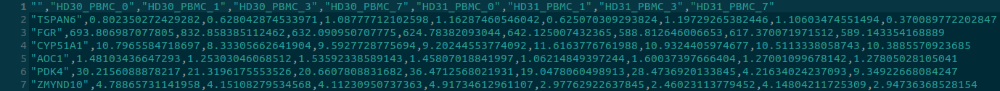
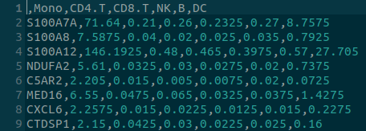

## Generally supported data types:

- rds
- csv
- tsv
- txt

### Data requirements:

#### Single cell RNA-seq data

- **Genes** x **Cells** matrix
- Counts are **not log-transformed**
- Rownames (gene names) are provided in the same format as in the bulk RNA-seq data, for instance HGNC symbols

#### Cell type annotations

- Vector containing cell type annotations
- Annotations are in the same order as the columns of the single cell matrix

#### Batch ids

- Vector containing batch ids, so sample or patient ids
- Ids are in the same order as the columns of the single cell matrix
- This is only necessary for Bisque, MuSiC and SCDC

#### (Marker genes)

- Vector containing gene names
- This is only necessary for BSeq-sc

#### Bulk RNA-seq data

- **Genes** x **Samples** matrix
- Rownames (gene names) are provided in the same format as in the sc RNA-seq data, for instance HGNC symbols

#### Signature

Supported data types:

- csv
- tsv
- rds

  For csv and tsv files the first column <strong>must</strong> contain gene identifiers

